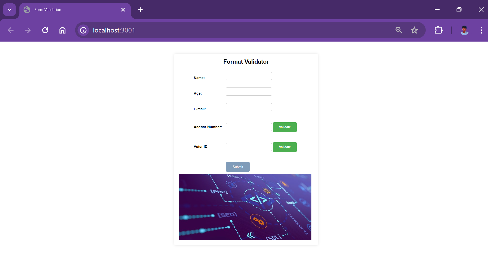
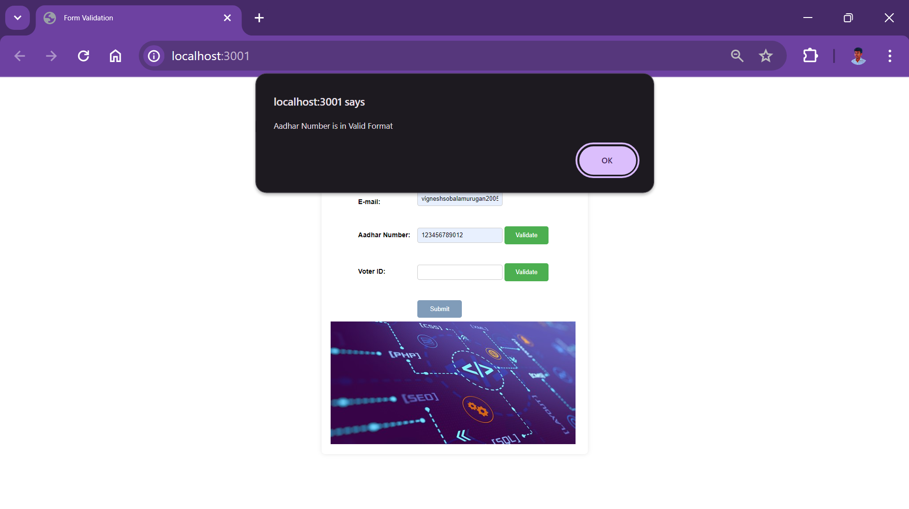
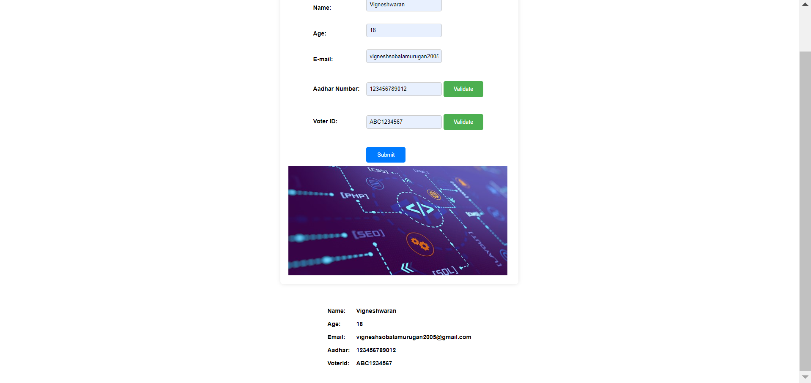

# Serving Static Files Over HTTP from Node.js

This repository contains a simple Node.js application that demonstrates how to serve static files over HTTP using the built-in `http` module.

## Overview

When building web applications with Node.js, serving static files such as HTML, CSS, JavaScript, and images is a common requirement. This project provides a basic example of how to accomplish this task using Node.js without the need for additional frameworks or libraries.

## Features

- **Simple and Lightweight**: The application is minimalistic and easy to understand.
- **No External Dependencies**: It relies only on Node.js built-in modules, making it lightweight and efficient.
- **Serves Various File Types**: Handles requests for HTML, CSS, JavaScript, images, etc.

## Screenshots

### Form

### Aadhar validate

 

### Voter ID validate

### Output

